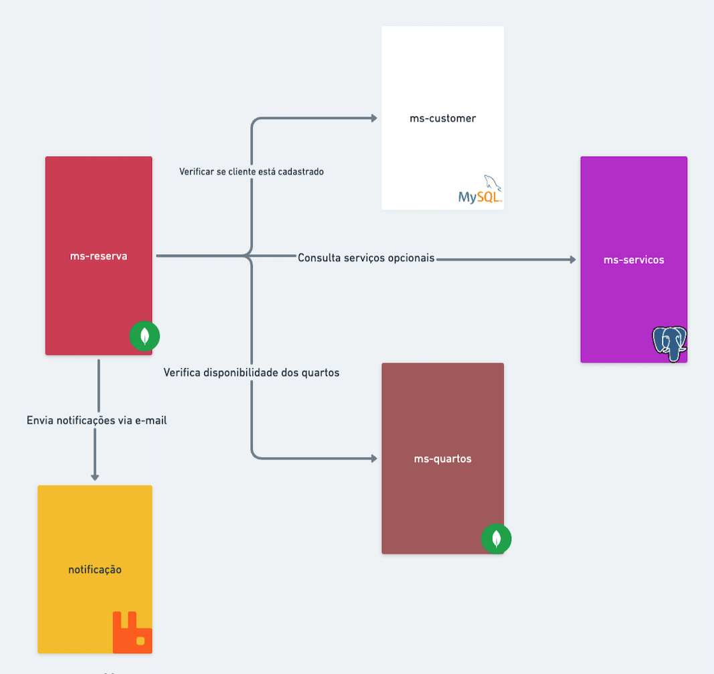

# Sistema de Gestão Hoteleira

Este projeto é um Sistema de Gestão Hoteleira desenvolvido para atender às necessidades de pequenos hotéis e pousadas, oferecendo uma solução completa e eficiente para gerenciar todas as operações relacionadas à hospedagem. Utilizando tecnologias modernas como Java 21, Spring, Docker, e bancos de dados MongoDB, MySQL e Postgres, este sistema abrange desde a gestão de quartos até a gestão de reservas.

## Tecnologias Adotadas

- **Java 21**: Linguagem de programação utilizada para o desenvolvimento do sistema.
- **Spring**: Framework utilizado para a construção de aplicativos Java.
- **Feign**: Biblioteca utilizada para criar clientes REST em Java.
- **Docker**: Plataforma de software que permite a criação, o envio e a execução de aplicativos em contêineres.
- **MongoDB**: Banco de dados não relacional utilizado para persistir as informações relacionadas aos quartos e outras entidades do sistema.
- **MySQL**: Banco de dados relacional utilizado para armazenar outras informações do sistema.
- **Postgres**: Outro banco de dados relacional utilizado para armazenamento de dados específicos do sistema.

## Arquitetura do Sistema

A arquitetura de microserviços é particularmente importante nesse cenário de sistema de gerenciamento de hotéis por algumas razões:

1. **Especialização Funcional:** Cada microserviço é focado em uma função específica (gerenciamento de usuários, reservas, quartos, serviços adicionais, notificações). Isso promove uma separação clara de preocupações, permitindo que as equipes de desenvolvimento se especializem e otimizem cada serviço independentemente.
2. **Agilidade e Escalabilidade:** Os microserviços podem ser desenvolvidos, implantados e escalados independentemente. Isso significa que, se houver uma demanda maior pelo serviço de reservas, por exemplo, apenas o `ms-reserva` pode ser escalado sem afetar os outros serviços. Isso é eficiente em termos de recursos e custos.
3. **Resiliência:** Se um microserviço falhar, ele não afeta diretamente os outros serviços. Por exemplo, se o `ms-quartos` estiver indisponível temporariamente, o `ms-customer` ainda pode operar. Isso melhora a resiliência geral do sistema.
4. **Manutenção e Atualização Facilitadas:** Atualizações, melhorias e manutenção podem ser realizadas em um microserviço sem interromper o restante do sistema. Isso reduz o tempo de inatividade e melhora a continuidade dos negócios.
5. **Tecnologia Heterogênea:** Cada serviço pode utilizar a pilha de tecnologia que melhor atenda às suas necessidades, permitindo a inovação e a adoção de novas tecnologias sem a necessidade de reescrever outros serviços.
6. **Desenvolvimento Distribuído:** Diferentes equipes podem trabalhar em diferentes microserviços simultaneamente, aumentando a velocidade de desenvolvimento e permitindo uma abordagem mais modular.
7. **Integração e Entrega Contínuas (CI/CD):** A arquitetura de microserviços facilita a integração e entrega contínuas, permitindo que mudanças sejam feitas rapidamente e com segurança no sistema em produção.
8. **Facilita a Experimentação:** Novos recursos ou serviços podem ser testados de maneira mais controlada e isolada, sem afetar o sistema como um todo.

Em resumo, pensamos em uma arquitetura de microserviços para fornecer uma estrutura que é adaptável, escalável, e fácil de manter, tudo isso

### Módulos do Sistema

### 1. Gestão de Quartos

Este módulo permite a administração detalhada dos quartos disponíveis nas propriedades hoteleiras, desde a definição das localidades e prédios até a configuração de cada quarto. Permite também a gestão de Enums como TipoQuarto, Movel e Amenidade.

Comandos curls para teste em linha de comando:
** Deixar em uma unica linha de comando do seu Sistema Operacional e tirar o caracter \ de quebra de linha.

Criar Localidade

  curl --location --request POST 'http://localhost:8082/api/v1/localidades' \
--header 'Content-Type: application/json' \
--data '{
  "id": "2",
  "nome": "Fazenda da Pós Tech",
  "endereco": {
    "id": 1,
    "rua": "Rua da Pós Tech, 567",
    "numero": "567",
    "cidade": "Cidade da Pós Tech",
    "bairro": "Bairro da Pós Tech",
    "estado": "Estado da Pós Tech",
    "cep": "01000-002"
  },
  "amenidades": [
    "PISCINA_ADULTO_AQUECIDA_COBERTA",
    "PISCINA_ADULTO_NAO_AQUECIDA_ABERTA",
    "PISCINA_INFANTIL_AQUECIDA_COBERTA",
    "PISCINA_INFANTIL_NAO_AQUECIDA_ABERTA",
    "RESTAURANTE_SELF_SERVICE",
    "RESTAURANTE_SELF_SERVICE",
    "RESTAURANTE_A_LA_CARTE",
    "AREA_KIDS",
    "EQUIPE_ENTRETENIMENTO_INFANTIL",
    "EQUIPE_ENTRETENIMENTO_ADULTO"
  ],
  "predios": [
    {
      "id": "2",
      "nome": "Casa Principal",
      "quartos": [
        {
          "id": "1",
          "tipo": "STANDARD_SIMPLES",
          "totalPessoas": 2,
          "totalCamas": 1,
          "valorDiaria": 350.00,
          "moveis": [
            "SOFA"
          ],
          "predioId": "1"
        }
      ],
       "localidadeId": "1"
    }
  ]
}

Listar todas Localidades

curl --location --request GET 'http://localhost:8082/api/v1/localidades'

Listar localidade por ID

curl --location --request GET 'http://localhost:8082/api/v1/localidades/1'

Alterar localidade

curl --location --request PUT 'http://localhost:8082/api/v1/localidades/1' \
--header 'Content-Type: application/json' \
--data '{
    "nome": "Fazenda da Pós Tech II",
    "endereco": {
        "id": 1,
        "rua": "Rua da Pós Tech, 567",
        "numero": "567",
        "cidade": "Cidade da Pós Tech",
        "bairro": "Bairro da Pós Tech",
        "estado": "Estado da Pós Tech",
        "cep": "01000-002"
    },
    "amenidades": [
        "PISCINA_ADULTO_AQUECIDA_COBERTA",
        "PISCINA_ADULTO_NAO_AQUECIDA_ABERTA",
        "PISCINA_INFANTIL_AQUECIDA_COBERTA",
        "PISCINA_INFANTIL_NAO_AQUECIDA_ABERTA",
        "RESTAURANTE_SELF_SERVICE",
        "RESTAURANTE_SELF_SERVICE",
        "RESTAURANTE_A_LA_CARTE",
        "AREA_KIDS",
        "EQUIPE_ENTRETENIMENTO_INFANTIL"
    ],
    "predios": [
        {
            "id": "P00002",
            "nome": "Casa Principal",
            "quartos": [
                {
                    "id": "Q00001",
                    "tipo": "STANDARD_SIMPLES",
                    "totalPessoas": 2,
                    "totalCamas": 1,
                    "valorDiaria": 350.00,
                    "moveis": [
                        "SOFA"
                    ]
                }
            ]
        }

Excluir localidade por Id

curl --location --request DELETE 'http://localhost:8082/api/v1/localidades/1'

Criar Prédio

curl --location --request POST 'http://localhost:8082/api/v1/predios' \
--header 'Content-Type: application/json' \
--data '{
  "id": "P00003",
  "nome": "Prédio teste",
  "quartos": [
    {
      "id": "Q00003",
      "tipo": "STANDARD_SIMPLES",
      "totalPessoas": 0,
      "totalCamas": 0,
      "valorDiaria": 0.00,
      "moveis": [
        "SOFA"
      ]
    }
  ]
}'

Listar todos os prédios

curl --location --request GET 'http://localhost:8082/api/v1/predios'

Buscar prédio  por ID

curl --location --request GET 'http://localhost:8082/api/v1/predios/P00001'

Alterar prédio

curl --location --request PUT 'http://localhost:8082/api/v1/predios/P00001' \
--header 'Content-Type: application/json' \
--data '{
    "id": "P00001",
    "nome": "Casa Principal",
    "quartos": [
        {
            "id": "Q00001",
            "tipo": "STANDARD_SIMPLES",
            "totalPessoas": 2,
            "totalCamas": 2,
            "valorDiaria": 400.00,
            "moveis": [
                "SOFA"
            ]
        }
    ]
}'

Excluir prédio por ID

curl --location --request DELETE 'http://localhost:8082/api/v1/predios/P00001'

Criar Quarto

curl --location --request POST 'http://localhost:8082/api/v1/quartos' \
--header 'Content-Type: application/json' \
--data '{
	  "id": "Q00003",
	  "tipo": "STANDARD_SIMPLES",
	  "totalPessoas": 0,
	  "totalCamas": 0,
	  "valorDiaria": 0.00,
	  "moveis": [
	    "SOFA"
	  ]
}'

Listar todos os Quartos

curl --location --request GET 'http://localhost:8082/api/v1/quartos'

Buscar Quarto por ID

curl --location --request GET 'http://localhost:8082/api/v1/quartos/1'

Atualizar Quarto

curl --location --request PUT 'http://localhost:8082/api/v1/quartos/1' \
--header 'Content-Type: application/json' \
--data '{
    "id": "id_6bd04eadddbc",
    "tipo": "STANDARD_SIMPLES",
    "totalPessoas": 2,
    "totalCamas": 2,
    "valorDiaria": 400.00,
    "moveis": [
        "SOFA"
    ]
}'

Excluir quarto por ID
	

curl --location --request DELETE 'http://localhost:8082/api/v1/quartos/3'

### 2. Gestão de Serviços e Opcionais

Aqui, os administradores podem gerenciar todos os serviços extras e itens opcionais oferecidos aos hóspedes, facilitando a oferta e a cobrança desses serviços aos clientes.

  Comandos curls para teste em linha de comando:
  ** Deixar em uma unica linha de comando do seu Sistema Operacional e tirar o caracter \ de quebra de linha.

  
Criar Serviço

  
  curl --location --request POST 'http://localhost:8085/servicos-opcionais' \
--header 'Content-Type: application/json' \
--data '{
	"nome":"Massagem",
    "valor":"250.00",
	"tipo":"SERVICO"

}'

Criar Opcionais

curl --location --request POST 'http://localhost:8085/servicos-opcionais' \
--header 'Content-Type: application/json' \
--data '{
	"nome":"Cerveja",
    "valor":"5.00",
	"tipo":"ITEM"

}'

Listar todos os Serviços e Opcionais

curl --location --request GET 'http://localhost:8085/servicos-opcionais?page=0&size=10'

Atualizar Serviços e Opcionais

curl --location --request PUT 'http://localhost:8085/servicos-opcionais/2' \
--header 'Content-Type: application/json' \
--data '{
    "nome": "Chocolate",
    "valor": "3.0",
    "tipo": "ITEM"
}'

Excluir Serviços e Opcionais

curl --location --request DELETE 'http://localhost:8085/servicos-opcionais/1'

Selecionar por ID um Serviço

curl --location --request GET 'http://localhost:8085/servicos-opcionais/2'

Selecionar por nome um serviço ou opcional

curl --location --request GET 'http://localhost:8085/servicos-opcionais/nome?nome=Chocolate'

### 3. Gestão de Clientes

Responsável pelo registro e manutenção das informações dos clientes do hotel, armazena dados pessoais e de contato. Esse módulo é crucial para personalizar a experiência do hóspede e gerenciar as informações dos clientes de forma segura e eficiente.

  Comandos curls para teste em linha de comando:
  ** Deixar em uma unica linha de comando do seu Sistema Operacional e tirar o caracter \ de quebra de linha.

Criar Cliente já com Endereço.

curl --location --request POST 'http://localhost:8080/v1/clientes' \
--header 'Content-Type: application/json' \
--data-raw '{
  "nome": "João",
  "sobrenome": "da Silva",
  "cpf": "123.456.789-00",
  "passaporte": "ABC123",
  "dataDeAniversario": "1990-01-01",
  "genero": "MASCULINO",
  "endereco": {
    "rua": "Rua das Flores",
    "numero": 123,
    "cidade": "São Paulo",
    "estado": "SP",
    "cep": "12345-678"
  },
  "paisDeOrigem": "Brasil",
  "nivel": "USER",
  "email": "joao@example.com",
  "usuario": "joaosilva",
  "senha": "senha123",
  "telefone": "(11) 91234-5678"
}'

Listar todos clientes

curl --location --request GET 'http://localhost:8080/v1/clientes'

Listar cliente por Id

curl --location --request GET 'http://localhost:8080/v1/clientes/1'

Excluir cliente por ID

curl --location --request DELETE 'http://localhost:8080/v1/clientes/1'

Atualizar CLiente

curl --location --request PUT 'http://localhost:8080/v1/clientes/2' \
--header 'Content-Type: application/json' \
--data-raw '{
  "nome": "João",
  "sobrenome": "da Silva",
  "cpf": "123.456.789-00",
  "passaporte": "ABC123",
  "dataDeAniversario": "1990-01-01",
  "genero": "FEMININO",
  "endereco": {
    "rua": "Rua das Flores",
    "numero": 123,
    "cidade": "São Paulo",
    "estado": "SP",
    "cep": "12345-678"
  },
  "paisDeOrigem": "Brasil",
  "nivel": "USER",
  "email": "joao@example.com",
  "usuario": "joaosilva",
  "senha": "senha123",
  "telefone": "(11) 91234-5678"
}'

### 4. Gestão de Reservas

Este microserviço é responsável pela criação de reservas em hotéis. Ele interage diretamente com os microserviços `ms-customer`, `ms-quartos` e `notificação`. Sua função é processar as reservas dos clientes e garantir a alocação dos quartos e serviços. A cor vermelha e o ícone de chave podem sugerir que ele é o ponto de entrada para o processo de reserva e desempenha um papel central na gestão das reservas.

* Verifica se o cliente está cadastrado no `ms-customer`
* Consulta a disponibilidade dos quartos no `ms-quartos`
* Consulta serviços opcionais no `ms-servicos`
* Envia notificações via e-mail através do microserviço de `notificação`

  Comandos curls para teste em linha de comando:
  ** Deixar em uma unica linha de comando do seru Sistema Operacional e oc carcter \ e quebra de linha.

Criar Reserva

  
curl --location --request POST 'http://localhost:8081/api/reservas' \
--header 'Content-Type: application/json' \
--data '{
    "clienteId": 1,
    "quartoIds": [
        "Q00001"
    ],
    "servicoOpcionalIds": [
        "1"
    ],
    "dataEntrada": "2024-05-16",
    "dataSaida": "2024-05-17",
    "numeroHospedes": 2
  }'

Buscar todas as Reservas

curl --location --request GET 'http://localhost:8081/api/reservas'

Buscar Reserva por ID

curl --location --request GET 'http://localhost:8081/api/reservas/65f4fe6248c78a4bb35193ba'

Excluir Reserva

curl --location --request DELETE 'http://localhost:8081/api/reservas/65f4fb4e2ca4fe461a4c0b8c'

Alterar Reserva

curl --location --request PUT 'http://localhost:8081/api/reservas/65f57f0609122e4ecaa9d3c8' \
--header 'Content-Type: application/json' \
--data '{
    "clienteId": 1,
    "quartoIds": [
        "Q00001"
    ],
    "servicoOpcionalIds": [
        "2"
    ],
    "dataEntrada": "2024-06-16",
    "dataSaida": "2024-06-20",
    "numeroHospedes": 2
}'

### 5. ms-notificacao

Este microserviço lida com a geração de eventos de notificação, como confirmações de reservas ou alertas de serviços, que são enviados aos usuários. Usa Java e RabbitMQ para a comunicação assíncrona de mensagens, mas não armazena dados permanentemente em um banco de dados.

## Como Executar o Projeto

Siga as etapas abaixo para executar o projeto em sua máquina local:

1. **Clone o Repositório:
2. **Importe o Projeto na sua IDE:**

Abra o projeto em sua IDE favorita (por exemplo, IntelliJ IDEA, Eclipse) e importe-o como um projeto Maven.

3.**Execute o Docker Compose:**

Certifique-se de ter o Docker instalado em sua máquina. Navegue até o diretório raiz do projeto clonado e execute o seguinte comando para iniciar os contêineres do MongoDB, MySQL e Postgres:

4.**Inicie os Serviços:**

Inicie os serviços necessários para o funcionamento do sistema, como o serviço de gestão de quartos, serviços e clientes. Isso geralmente pode ser feito executando a aplicação principal do projeto na sua IDE.

Após seguir essas etapas, o sistema estará em execução em sua máquina local e você poderá acessá-lo através dos endpoints especificados na documentação. Certifique-se de verificar se todos os serviços estão em execução corretamente antes de utilizar o sistema.

## Informações Adicionais

### Integrantes do Grupo – Grupo 29:

- William Kaminski - RM 430025
- Diogo Henrique Valente - RM 348497
- Igor Pereira Rocha Oliveira - RM 349895
- Arlei Pacanaro Lepiani - RM 350113
- Matheus Sena - RM 348505

### Recursos do Projeto:

- Link do projeto no GitHub: [hackathon-fiap](https://github.com/dhvalente/hackathon-fiap)
- Link do vídeo explicativo: [Vídeo Explicativo](https://drive.google.com/drive/folders/1KrLraKYwZL2uR_8Ft9oHrU8vgKvzWwWA?usp=sharing)

Este README fornece uma visão geral do sistema e das tecnologias utilizadas, além de recursos adicionais para mais informações sobre o projeto.
